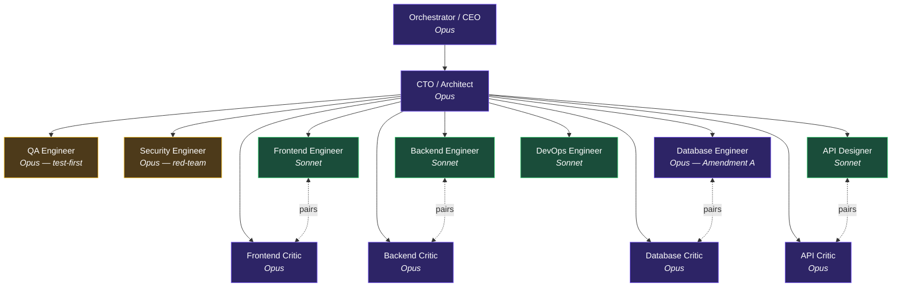

# Olympus Org Chart — Reporting + Pairing

> Reporting hierarchy lives in Paperclip's tree-based org chart UI at `127.0.0.1:3100`.
> **Pairing relationships are NOT renderable in Paperclip's tree UI** — they live here.

The Olympus team adopted the **Heterogeneous Producer-Critic with Test-First Critique + Architectural Gate** pattern on 2026-04-29 (per [OLY-11](../companies/olympus.md)). Critics report to CTO for **independence**, but pair with their producer counterpart on every implementation task. Paperclip's org chart can't draw peer pair edges (no tree UI can) — this document is the canonical pairing reference.

## Mermaid view (reporting + pairing)



> Solid edges are `reportsTo`. Dashed `<-..->` edges are pairing relationships used by the CEO's routing playbook on every implementation task. DevOps Engineer has no Critic by design — Security Engineer covers the review surface.

## ASCII view (terminal-friendly)

```
                            ┌──────────────────────┐
                            │ Orchestrator / CEO   │   Opus
                            └──────────┬───────────┘
                                       │
                            ┌──────────▼───────────┐
                            │ CTO / Architect      │   Opus
                            │ (architectural gate) │
                            └──────────┬───────────┘
                                       │
              ┌────────────────────────┼────────────────────────┐
              │                        │                        │
   ┌──────────▼───────┐     ┌──────────▼─────────┐    ┌─────────▼───────┐
   │ QA Engineer      │     │ Security Engineer  │    │ DevOps Engineer │
   │ Opus             │     │ Opus               │    │ Sonnet          │
   │ test-first       │     │ red-team every PR  │    │ infra / CI      │
   └──────────────────┘     └────────────────────┘    └─────────────────┘
                                       │
              ┌────────────────────────┴───────────────────────────┐
              │                                                    │
              │            (specialist producers below pair        │
              │             with their critic counterpart)         │
              │                                                    │
   ┌──────────▼─────────┐                          ┌───────────────▼────┐
   │ Frontend Engineer  │ ◄──── pairs ────►        │ Frontend Critic    │
   │ Sonnet             │                          │ Opus               │
   └────────────────────┘                          └────────────────────┘

   ┌────────────────────┐                          ┌────────────────────┐
   │ Backend Engineer   │ ◄──── pairs ────►        │ Backend Critic     │
   │ Sonnet             │                          │ Opus               │
   └────────────────────┘                          └────────────────────┘

   ┌────────────────────┐                          ┌────────────────────┐
   │ Database Engineer  │ ◄──── pairs ────►        │ Database Critic    │
   │ Opus (Amendment A) │                          │ Opus               │
   └────────────────────┘                          └────────────────────┘

   ┌────────────────────┐                          ┌────────────────────┐
   │ API Designer       │ ◄──── pairs ────►        │ API Critic         │
   │ Sonnet             │                          │ Opus               │
   └────────────────────┘                          └────────────────────┘
```

## Pairing matrix (canonical, machine-readable)

| Producer | Producer ID | Producer model | Critic | Critic ID | Critic model | Discipline scope |
|---|---|---|---|---|---|---|
| Frontend Engineer | `c698ce1d-0f8b-4d34-8791-253f702b27c3` | Sonnet | Frontend Critic | `81f04cfc-b8c1-46bb-89cf-6bb0a857b92a` | **Opus** | Next.js / React / Tailwind / a11y / PRD `01-conventions.md` § 3.3 |
| Backend Engineer | `7cc24e11-4ea6-4df8-942e-998f84f0d28e` | Sonnet | Backend Critic | `b1dd31d7-622a-4dfe-854b-eca55d56c453` | **Opus** | Go / Chi / pgx / sqlc / OpenAPI contract |
| Database Engineer | `76b65114-02f9-4b90-8803-90aba21bdb9d` | **Opus** (Amendment A) | Database Critic | `a5e50b32-b664-45fe-9ff2-ca242029879b` | **Opus** | Postgres migrations + sqlc queries + index strategy |
| API Designer | `de5fe798-7d06-467c-8c15-fdbf9dd1a4d8` | Sonnet | API Critic | `b16585ed-01ab-4ba8-9d43-2f3b6b045516` | **Opus** | `api.yaml` / generated TS client / response envelopes |
| DevOps Engineer | `d7dd47a2-97c1-4d1a-9ffc-abe1e0f6236e` | Sonnet | (none — by design) | — | — | Infra / CI; Security Engineer covers review surface |

## Per-task flow (how the pair is invoked)

```
Task arrives
    │
    ▼
1. CTO decomposes              ←── Opus
2. QA writes tests FIRST       ←── Opus (independent, runs once per task)
3. Producer implements         ←── Sonnet (or Opus for DB)
4. Critic reviews diff         ←── Opus (paired with producer, hard 2-loop budget)
5. Security red-teams PR       ←── Opus (independent, runs once after Critic)
6. CTO architectural gate      ←── Opus (final verdict — APPROVE-MERGE / BLOCK-FIX / BLOCK-ESCALATE)
7. Merge → DevOps + CI         ←── Sonnet + tooling
```

## Heterogeneity invariant (non-negotiable)

> **Every Critic uses a different model from its paired producer.** Charter-level invariant per [OLY-11](../companies/olympus.md). Reflexion (Shinn 2023) and Constitutional AI (Bai 2022): same-model pairs collapse to ~30% reduced cross-error detection vs heterogeneous pairs. Do NOT "correct" any Critic to Sonnet to save cost — Tier-1 budget already accounts for the 4 Opus Critics.

The exception (Database) keeps both pair members on Opus because:
- Database Engineer was upgraded to Opus per Amendment A (irreversibility premium on migrations) — see [`companies/olympus.md`](../companies/olympus.md) § "Producer-Critic pairing matrix"
- Cross-model heterogeneity sacrificed for reasoning depth on irreversible state changes
- The "different agent / different system prompt / different recent-context" sub-heterogeneity is preserved

## Why pairing isn't a `reportsTo` edge

Tree UIs (Paperclip / Workday / Lattice / BambooHR) all share this limitation: they render parent-child reporting only. Peer pairing is a working relationship, not a reporting relationship. Making the Critic report to its producer would compromise independence — a Critic that reports to the engineer they're critiquing is a toothless Critic.

The pairing therefore lives in three places, in priority order:
1. **Each Critic's charter** at `dev-agents/roles/<critic>.md` — verbatim "pairs with [Engineer]" hard-rule paragraph
2. **The CEO's routing playbook** — invokes the pair on every implementation task
3. **Each Critic's `title` field** in Paperclip — visible on the org-chart card as `Backend Critic ↔ Backend Engineer` etc. (best Paperclip can do)

This document is the durable visual reference for everything Paperclip can't show.

## Last updated

2026-04-29 — Step 3 of OLY-11 producer-critic adoption complete. 4 critic agents hired and active (live in Paperclip company `ec35552a-a808-46f3-acbe-4e6dec4969f1`). Pilots OLY-16 (#693) and OLY-17 (#694) in flight.
