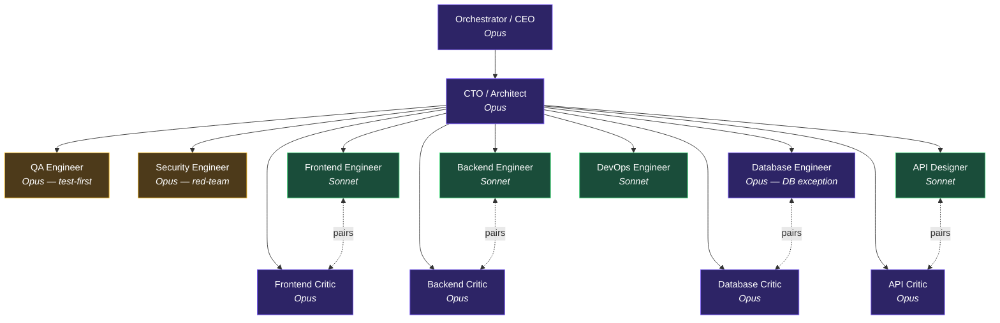

# Producer-Critic Org Chart — Reporting + Pairing

> Reporting hierarchy lives in Paperclip's tree-based org chart UI at `127.0.0.1:3100`.
> **Pairing relationships are NOT renderable in Paperclip's tree UI** — they live here.

The standard team structure for any company in `companies/` uses the **Heterogeneous Producer-Critic with Test-First Critique + Architectural Gate** pattern. Critics report to CTO for **independence**, but pair with their producer counterpart on every implementation task. Paperclip's org chart can't draw peer pair edges (no tree UI can) — this document is the canonical pairing reference.

## Mermaid view (reporting + pairing)



> Solid edges are `reportsTo`. Dashed `<-..->` edges are pairing relationships used by the CEO's routing playbook on every implementation task. DevOps Engineer has no Critic by design — Security Engineer covers the review surface.

## ASCII view (terminal-friendly)

```
                            ┌──────────────────────┐
                            │ Orchestrator / CEO   │   Opus
                            └──────────┬───────────┘
                                       │
                            ┌──────────▼───────────┐
                            │ CTO / Architect      │   Opus
                            │ (architectural gate) │
                            └──────────┬───────────┘
                                       │
              ┌────────────────────────┼────────────────────────┐
              │                        │                        │
   ┌──────────▼───────┐     ┌──────────▼─────────┐    ┌─────────▼───────┐
   │ QA Engineer      │     │ Security Engineer  │    │ DevOps Engineer │
   │ Opus             │     │ Opus               │    │ Sonnet          │
   │ test-first       │     │ red-team every PR  │    │ infra / CI      │
   └──────────────────┘     └────────────────────┘    └─────────────────┘
                                       │
              ┌────────────────────────┴───────────────────────────┐
              │                                                    │
              │            (specialist producers below pair        │
              │             with their critic counterpart)         │
              │                                                    │
   ┌──────────▼─────────┐                          ┌───────────────▼────┐
   │ Frontend Engineer  │ ◄──── pairs ────►        │ Frontend Critic    │
   │ Sonnet             │                          │ Opus               │
   └────────────────────┘                          └────────────────────┘

   ┌────────────────────┐                          ┌────────────────────┐
   │ Backend Engineer   │ ◄──── pairs ────►        │ Backend Critic     │
   │ Sonnet             │                          │ Opus               │
   └────────────────────┘                          └────────────────────┘

   ┌────────────────────┐                          ┌────────────────────┐
   │ Database Engineer  │ ◄──── pairs ────►        │ Database Critic    │
   │ Opus (DB exception)│                          │ Opus               │
   └────────────────────┘                          └────────────────────┘

   ┌────────────────────┐                          ┌────────────────────┐
   │ API Designer       │ ◄──── pairs ────►        │ API Critic         │
   │ Sonnet             │                          │ Opus               │
   └────────────────────┘                          └────────────────────┘
```

## Pairing matrix (canonical)

| Producer | Producer model | Critic | Critic model | Discipline scope |
|---|---|---|---|---|
| Frontend Engineer (`roles/web-frontend.md`) | Sonnet | Frontend Critic (`roles/frontend-critic.md`) | **Opus** | Next.js / React / Tailwind / a11y |
| Backend Engineer (`roles/go-backend.md`) | Sonnet | Backend Critic (`roles/backend-critic.md`) | **Opus** | Go / Chi / pgx / sqlc / OpenAPI contract |
| Database Engineer (`roles/db-architect.md`) | **Opus** (DB exception) | Database Critic (`roles/database-critic.md`) | **Opus** | Postgres migrations + sqlc queries + index strategy |
| API Designer (`roles/api-designer.md`) | Sonnet | API Critic (`roles/api-critic.md`) | **Opus** | `api.yaml` / generated TS client / response envelopes |
| DevOps Engineer (`roles/devops.md`) | Sonnet | (none — by design) | — | Infra / CI; Security Engineer covers review surface |

The concrete Paperclip agent IDs for each producer/critic in a given company are recorded in that company's manifest (`companies/<name>.md`), not here — IDs are per-deployment.

## Per-task flow (how the pair is invoked)

```
Task arrives
    │
    ▼
1. CTO decomposes              ←── Opus
2. QA writes tests FIRST       ←── Opus (independent, runs once per task)
3. Producer implements         ←── Sonnet (or Opus for DB)
4. Critic reviews diff         ←── Opus (paired with producer, hard 2-loop budget)
5. Security red-teams PR       ←── Opus (independent, runs once after Critic)
6. CTO architectural gate      ←── Opus (final verdict — APPROVE-MERGE / BLOCK-FIX / BLOCK-ESCALATE)
7. Merge → DevOps + CI         ←── Sonnet + tooling
```

## Heterogeneity invariant (non-negotiable)

> **Every Critic uses a different model from its paired producer.** Same-model pairs collapse to ~30% reduced cross-error detection vs heterogeneous pairs (Reflexion — Shinn 2023; Constitutional AI — Bai 2022; Anthropic 2025 multi-agent cookbook). Do NOT "correct" any Critic to Sonnet to save cost.

### Database exception (both on Opus)

The Database pair keeps both members on Opus because:

- **Irreversibility premium on migrations.** Database Engineer is upgraded to Opus to give reasoning depth on schema changes that can't be cheaply rolled back.
- **Cross-model heterogeneity is sacrificed** for reasoning depth on irreversible state changes — a deliberate trade-off, not a violation.
- **Sub-heterogeneity is preserved**: different agent identity, different system prompt (producer charter vs critic charter), different recent-context window. The pair still catches issues a single agent would miss.

This exception applies only to the Database pair. All other producer-critic pairs MUST cross models.

## Why pairing isn't a `reportsTo` edge

Tree UIs (Paperclip / Workday / Lattice / BambooHR) all share this limitation: they render parent-child reporting only. Peer pairing is a working relationship, not a reporting relationship. Making the Critic report to its producer would compromise independence — a Critic that reports to the engineer they're critiquing is a toothless Critic.

The pairing therefore lives in three places, in priority order:

1. **Each Critic's charter** at `roles/<critic>.md` — verbatim "pairs with [Engineer]" hard-rule paragraph
2. **The CEO's routing playbook** — invokes the pair on every implementation task
3. **Each Critic's `title` field** in Paperclip — visible on the org-chart card as `Backend Critic ↔ Backend Engineer` etc. (best Paperclip can do)

This document is the durable visual reference for everything Paperclip can't show.
