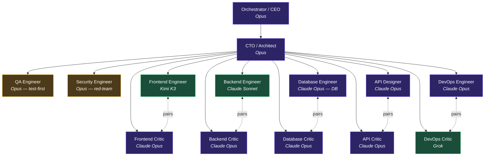

# Producer-Critic Org Chart — Reporting + Pairing

> Reporting hierarchy lives in Paperclip's tree-based org chart UI at `127.0.0.1:3100`.
> **Pairing relationships are NOT renderable in Paperclip's tree UI** — they live here.

The standard team structure for any company in `companies/` uses the **Heterogeneous Producer-Critic with Test-First Critique + Architectural Gate** pattern. Critics report to CTO for **independence**, but pair with their producer counterpart on every implementation task. Paperclip's org chart can't draw peer pair edges (no tree UI can) — this document is the canonical pairing reference.

## Mermaid view (reporting + pairing)


```mermaid
graph TD
    classDef opus fill:#2d2466,stroke:#7c5dfa,color:#fff
    classDef sonnet fill:#1a4d3a,stroke:#4ade80,color:#fff
    classDef oversight fill:#4d3a1a,stroke:#fbbf24,color:#fff

    CEO["Orchestrator / CEO<br/><i>Opus</i>"]:::opus
    CTO["CTO / Architect<br/><i>Opus</i>"]:::opus
    CEO --> CTO

    QA["QA Engineer<br/><i>Opus — test-first</i>"]:::oversight
    SEC["Security Engineer<br/><i>Opus — red-team</i>"]:::oversight
    CTO --> QA
    CTO --> SEC

    FE["Frontend Engineer<br/><i>Kimi K3</i>"]:::sonnet
    FEC["Frontend Critic<br/><i>Claude Opus</i>"]:::opus
    BE["Backend Engineer<br/><i>Claude Sonnet</i>"]:::sonnet
    BEC["Backend Critic<br/><i>Claude Opus</i>"]:::opus
    DB["Database Engineer<br/><i>Claude Opus — DB</i>"]:::opus
    DBC["Database Critic<br/><i>Claude Opus</i>"]:::opus
    API["API Designer<br/><i>Claude Opus</i>"]:::opus
    APIC["API Critic<br/><i>Claude Opus</i>"]:::opus
    DEVOPS["DevOps Engineer<br/><i>Claude Opus</i>"]:::opus
    DEVOPSC["DevOps Critic<br/><i>Grok</i>"]:::sonnet

    CTO --> FE
    CTO --> FEC
    CTO --> BE
    CTO --> BEC
    CTO --> DB
    CTO --> DBC
    CTO --> API
    CTO --> APIC
    CTO --> DEVOPS
    CTO --> DEVOPSC

    FE <-..->|pairs| FEC
    BE <-..->|pairs| BEC
    DB <-..->|pairs| DBC
    API <-..->|pairs| APIC
    DEVOPS <-..->|pairs| DEVOPSC
```

> Solid edges are `reportsTo`. Dashed `<-..->` edges are pairing relationships used by the CEO's routing playbook on every implementation task. DevOps Engineer pairs with the DevOps Critic, which runs on a non-Anthropic model (Grok, failover Kimi), the second cross-vendor pair in the fleet after Frontend. It previously had no Critic, with Security Engineer named as the substitute; that never held, because `security-reviewer` is dispatched by no script, its own charter only activates *after* a paired Critic signs off, and vulnerability review is a different axis from "does this pipeline do what it claims".

### Routine-driven discovery (no pair)

> **Config wins:** live vendor + Claude tier always come from `config/workers.yaml` + `config/routing.yaml`. Quality-first policy (2026-07-28): judgment/irreversible seats use Opus; implementation producers stay Sonnet when paired with an Opus critic; Frontend primary is **Kimi K3**.

The **PR Sentinel** (`roles/pr-sentinel.md`, Claude sonnet, reports to CTO) may run as a Paperclip routine and/or local launchd sentinel (`docs/local-pr-sentinel.md`). It scans the GitHub PR queue, classifies un-attached PRs by branch prefix, and files Paperclip tasks for the appropriate review chain. It does NOT pair with a Critic — its output is routing tasks, not code, so there's nothing for a Critic to critique. It also doesn't review, approve, or merge — it discovers and routes; existing chain takes over. Without it, dependabot / direct-board / external-contrib PRs would sit unreviewed because the producer-critic chain only fires on Paperclip-filed work.

**Two outputs per scan:**

1. **Triage** — un-attached PRs are filed as Paperclip tasks routed to the appropriate reviewer chain (DevOps for dependabot, CTO full chain for substantive PRs, docs-writer for docs-only PRs, CTO + extra security scrutiny for external contrib).
2. **Merge queue digest** — a single rolling Paperclip issue (`Merge Queue Digest — <company>`) is updated every scan with a snapshot of: ready-to-merge PRs (CI green + at least one APPROVE review), pending review (routing task in flight, no APPROVE yet), awaiting CI (approved but checks failing), and anomalies (PRs ready-to-merge for >24h, REQUEST-CHANGES blockers). The board reads this digest as the canonical "what should I merge next" signal.

**Approval mechanism the digest depends on:** every reviewer agent that approves a PR MUST use `gh pr review <N> --approve` — not a plain `gh pr comment` — because comments don't register on GitHub's `review:approved` filter. The Sentinel charter encodes this rule and includes it in every routing task it files; existing reviewer agents (CEO, CTO, DevOps, Critics, Security) inherit the discipline as Sentinel-routed tasks arrive.

## ASCII view (terminal-friendly)

```
                            ┌──────────────────────┐
                            │ Orchestrator / CEO   │   Opus
                            └──────────┬───────────┘
                                       │
                            ┌──────────▼───────────┐
                            │ CTO / Architect      │   Opus
                            │ (architectural gate) │
                            └──────────┬───────────┘
                                       │
              ┌────────────────────────┼────────────────────────┐
              │                        │                        │
   ┌──────────▼───────┐     ┌──────────▼─────────┐    ┌─────────▼───────┐
   │ QA Engineer      │     │ Security Engineer  │    │ DevOps Engineer │
   │ Opus             │     │ Opus               │    │ Opus            │
   │ test-first       │     │ red-team every PR  │    │ infra / CI      │
   └──────────────────┘     └────────────────────┘    └─────────────────┘
                                       │
              ┌────────────────────────┴───────────────────────────┐
              │                                                    │
              │            (specialist producers below pair        │
              │             with their critic counterpart)         │
              │                                                    │
   ┌──────────▼─────────┐                          ┌───────────────▼────┐
   │ Frontend Engineer  │ ◄──── pairs ────►        │ Frontend Critic    │
   │ Kimi K3            │                          │ Claude Opus        │
   └────────────────────┘                          └────────────────────┘

   ┌────────────────────┐                          ┌────────────────────┐
   │ Backend Engineer   │ ◄──── pairs ────►        │ Backend Critic     │
   │ Claude Sonnet      │                          │ Claude Opus        │
   └────────────────────┘                          └────────────────────┘

   ┌────────────────────┐                          ┌────────────────────┐
   │ Database Engineer  │ ◄──── pairs ────►        │ Database Critic    │
   │ Claude Opus (DB)   │                          │ Claude Opus        │
   └────────────────────┘                          └────────────────────┘

   ┌────────────────────┐                          ┌────────────────────┐
   │ API Designer       │ ◄──── pairs ────►        │ API Critic         │
   │ Claude Opus        │                          │ Claude Opus        │
   └────────────────────┘                          └────────────────────┘
```

## Pairing matrix (canonical)

| Producer | Vendor | Model / tier | Critic | Critic tier | Discipline |
|---|---|---|---|---|---|
| Frontend (`web-frontend`) | **kimi** (failover claude) | **K3** | `frontend-critic` | **opus** | Next.js / React / Tailwind / a11y |
| Backend (`go-backend`) | claude | **sonnet** | `backend-critic` | **opus** | Go / Chi / pgx / sqlc |
| Database (`db-architect`) | claude | **opus** (irreversible) | `database-critic` | **opus** | Migrations / sqlc / indexes |
| API Designer (`api-designer`) | claude | **opus** | `api-critic` | **opus** | `api.yaml` / envelopes |
| DevOps (`devops`) | claude | **opus** | `devops-critic` | **grok** (failover kimi) | CI / deploy / infra |
| Plan critic (`plan-critic`) | **grok** | CLI default | (Pass 4 autoplan) | — | Wave-plan review |

Cross-cutting (Claude **opus** unless noted): `test-engineer`, `security-reviewer`, `cto`, `orchestrator`, `investigate`, `retro`. `docs-writer` → **claude-fable-5**. `pr-sentinel` → **sonnet** (routing volume).

The concrete Paperclip agent IDs for each producer/critic in a given company are recorded in that company's manifest (`companies/<name>.md`), not here — IDs are per-deployment.

## Per-task flow (how the pair is invoked)

```
Task arrives
    │
    ▼
1. CTO decomposes              ←── Opus
2. QA writes tests FIRST       ←── Opus (independent, runs once per task)
3. Producer implements         ←── Sonnet (or Opus for DB)
4. Critic reviews diff         ←── Opus (paired with producer, hard 2-loop budget)
5. Security red-teams PR       ←── Opus (independent, runs once after Critic)
6. CTO architectural gate      ←── Opus (final verdict — APPROVE-MERGE / BLOCK-FIX / BLOCK-ESCALATE)
7. Merge → DevOps + CI         ←── Opus + tooling
```

## Heterogeneity invariant (non-negotiable)

> **Every Critic uses a different model from its paired producer.** Same-model pairs collapse to ~30% reduced cross-error detection vs heterogeneous pairs (Reflexion — Shinn 2023; Constitutional AI — Bai 2022; Anthropic 2025 multi-agent cookbook). Do NOT "correct" any Critic to Sonnet to save cost.

### Database exception (both on Opus)

The Database pair keeps both members on Opus because:

- **Irreversibility premium on migrations.** Database Engineer is upgraded to Opus to give reasoning depth on schema changes that can't be cheaply rolled back.
- **Cross-model heterogeneity is sacrificed** for reasoning depth on irreversible state changes — a deliberate trade-off, not a violation.
- **Sub-heterogeneity is preserved**: different agent identity, different system prompt (producer charter vs critic charter), different recent-context window. The pair still catches issues a single agent would miss.

This exception applies only to the Database pair. All other producer-critic pairs MUST cross models.

## Why pairing isn't a `reportsTo` edge

Tree UIs (Paperclip / Workday / Lattice / BambooHR) all share this limitation: they render parent-child reporting only. Peer pairing is a working relationship, not a reporting relationship. Making the Critic report to its producer would compromise independence — a Critic that reports to the engineer they're critiquing is a toothless Critic.

The pairing therefore lives in three places, in priority order:

1. **Each Critic's charter** at `roles/<critic>.md` — verbatim "pairs with [Engineer]" hard-rule paragraph
2. **The CEO's routing playbook** — invokes the pair on every implementation task
3. **Each Critic's `title` field** in Paperclip — visible on the org-chart card as `Backend Critic ↔ Backend Engineer` etc. (best Paperclip can do)

This document is the durable visual reference for everything Paperclip can't show.
